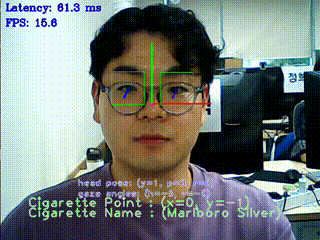

# Team Black_Pink
---------------------------
# Estimating the gaze of cigarette purchasing customers

## Goals
1. 고객의 시선을 통해서 고객앞에 있는 좌표평면상의 좌표를 추정한다.
2. 고객의 얼굴을 인식해서 나이를 추정하여 신분증 검사를 한다.

## Member
1. WonJin Jo
2. YongJae Jung

## R & R
1. 모델 커스터 마이징: YongJae Jung
2. 모델 테스트 및 개선: WonJin Jo
3. 문서정리: WonJin Jo
4. 자료조사 및 개발 매니징: YongJae Jung 

## Model Used
1. Gaze Recognition
2. Face Detection

## View code difference
https://www.diffchecker.com/ZjY0t2te/

## 동작방식

1. Open model zoo의 gaze_estimation 모델로
	- 시선의 Horizontal, Vertical 값 계산
	- head pose estimation 모델로 머리 자세 (Yaw, Pitch, Roll) 값 계산
2. 데이터를 2D 좌표계로 변환
	- 머리 자세 각도 (Yaw, Pitch, Roll)을 가지고 복합 회전 행렬 R을 계산
	- 시선 방향 벡터를 계산
	- 시선 방향 벡터와 복합 회전 행렬 R을 행렬 곱하여 세계 좌표계로 변환
	- 2D 평면에 시선 방향 투영

3. 계산된 좌표를 UI에 putText

## Tools
1. Open Model Zoo
2. ChatGPT
3. VS Code
