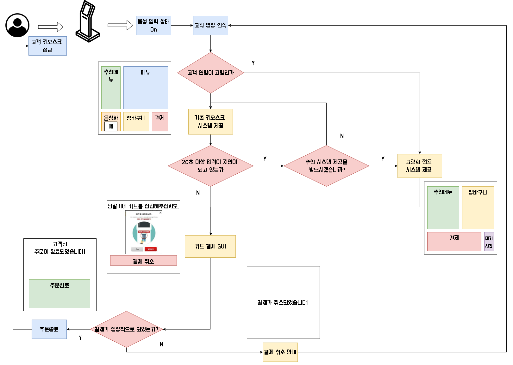
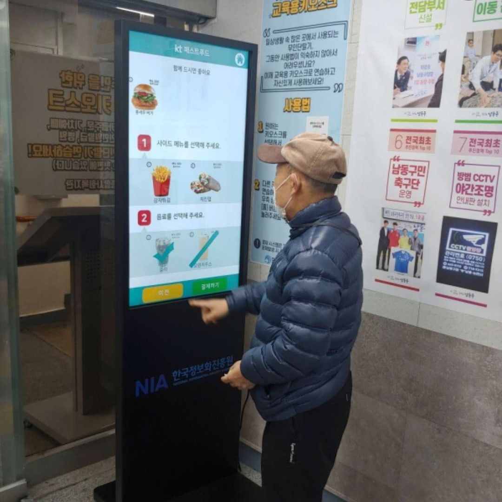

# Project E-Z Kiosk

"누군가에게는 어려운 키오스크를 누구나 쉽게 사용하는 키오스크로"

## High Level Design



## Clone code

* (각 팀에서 프로젝트를 위해 생성한 repository에 대한 code clone 방법에 대해서 기술)

```shell
git clone https://github.com/wodud6423/Intel-Edge-AI-.git
```

## Prerequite

```shell
python -m venv .venv
source .venv/bin/activate
pip install -r requirements.txt
```

## Steps to build

```shell
cd ~/xxxx
source .venv/bin/activate

make
make install
```

## Steps to run

```shell
cd ~/xxxx
source .venv/bin/activate

cd /path/to/repo/xxx/
python demo.py -i xxx -m yyy -d zzz
```

## Output




## Appendix

