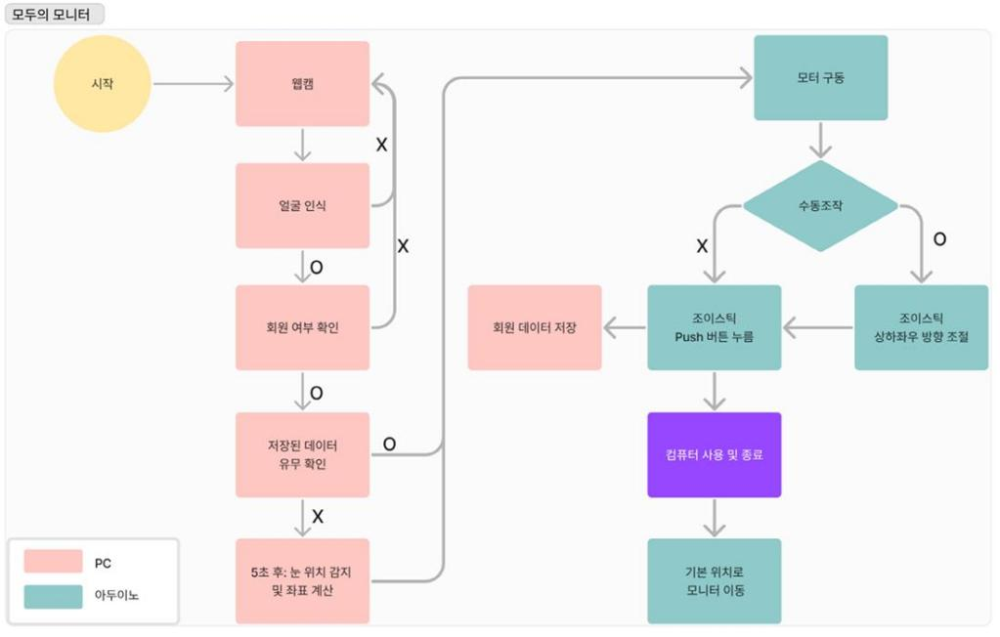
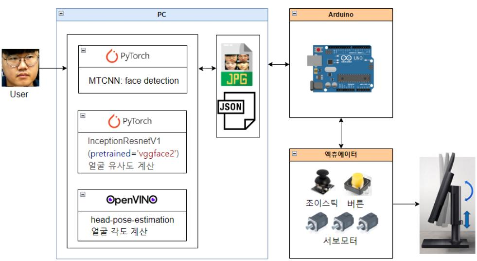
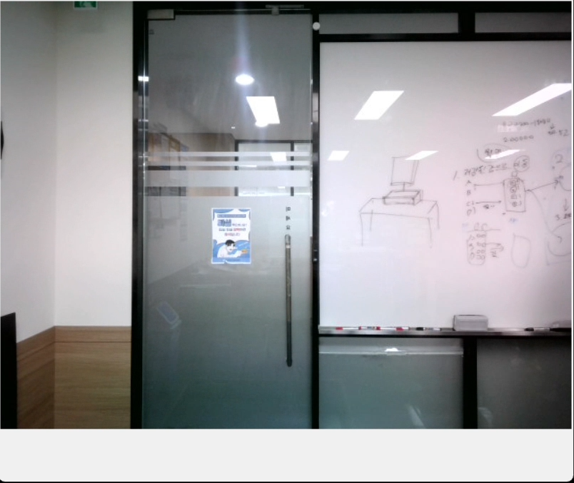
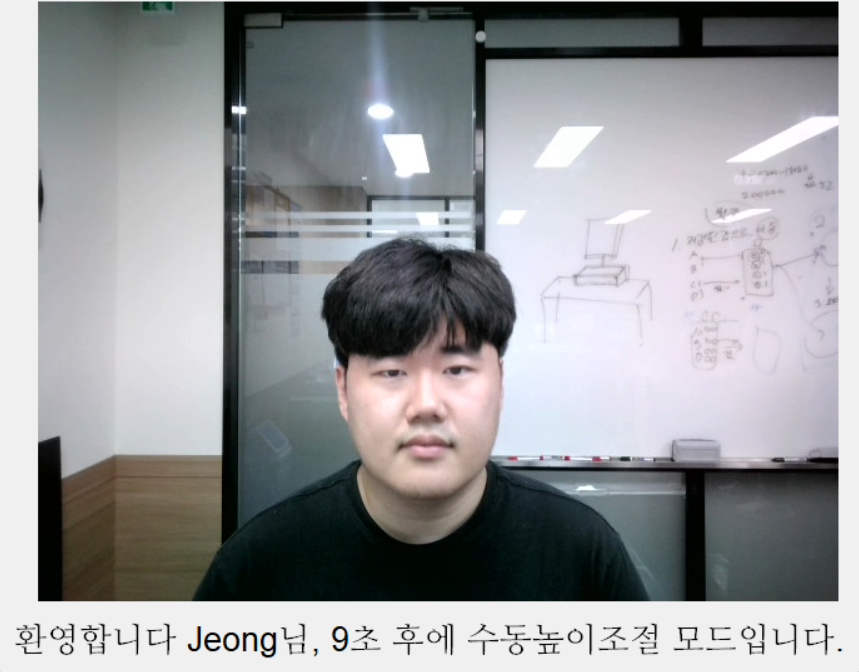
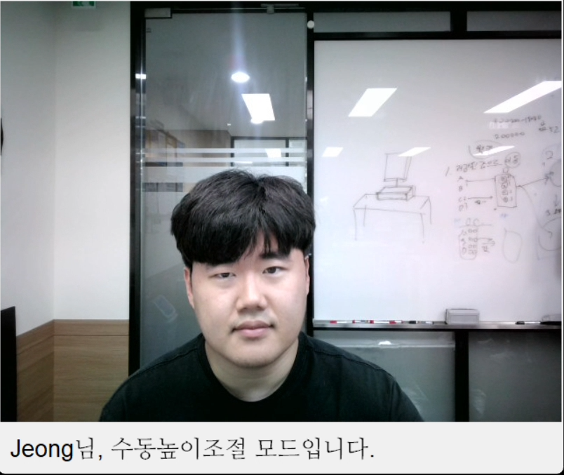

# GOPENVINO
AI를 이용한 스마트 모니터 제어 시스템

## 개발 계획 (gantt chart)


## High Level Design
* flow chart


* 아키텍쳐


## Clone code
```
git clone https://github.com/KORIDO1234/gopenvino.git
```

## Prerequite

### desktop 설정
1. clone한 폴더로 이동
```
cd ./gopoenvino
```
2. 가상 환경 생성 (python 버전 3.10.12
```
python3 -m venv .venv
```
3. 가상 환경 실행
```
source .venv/bin/activate
```
4. 요구 패키지 설치
```
pip install -r requirements.txt
```

### H/W 설정
1. arduino UNO에 code.ino 업로드

## Steps to build
* 가상환경 활성화
```
source .venv/bin/activate
```

## Steps to run
* src 폴더로 이동 후 메인파일 실행
```
cd ./src/desktop
python face_recog_arduino.py
```
* 오류 발생 시 face_recog_arduino.py 아두이노 포트 번호, 이미지파일 경로, json파일 경로, 모델 경로 확인
## Output
1. 대기중


2. 자동 조정 중


3. 수동 조정 중

